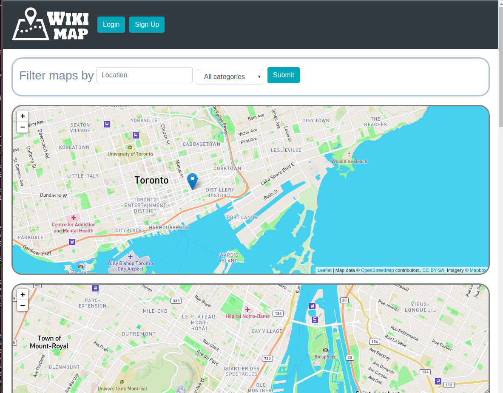
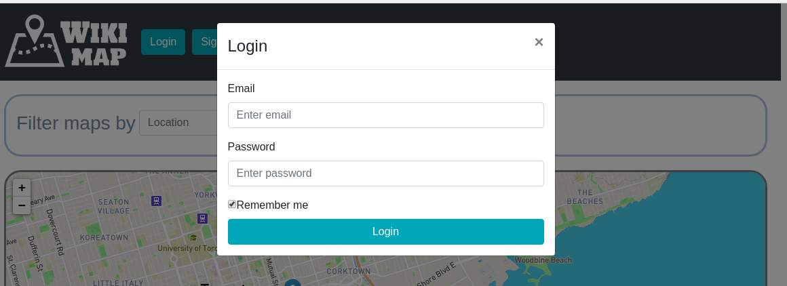
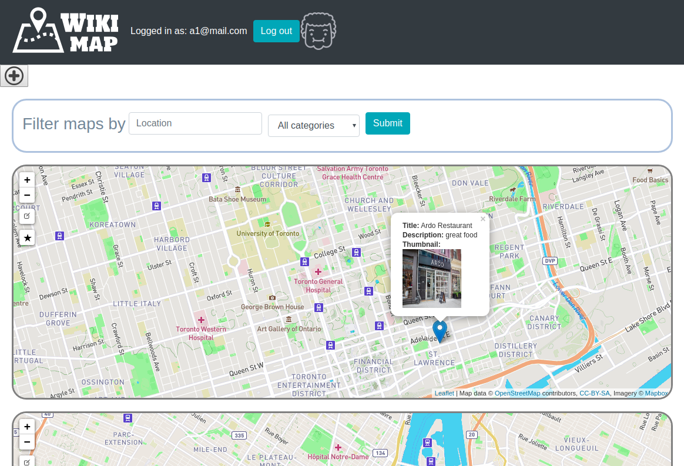
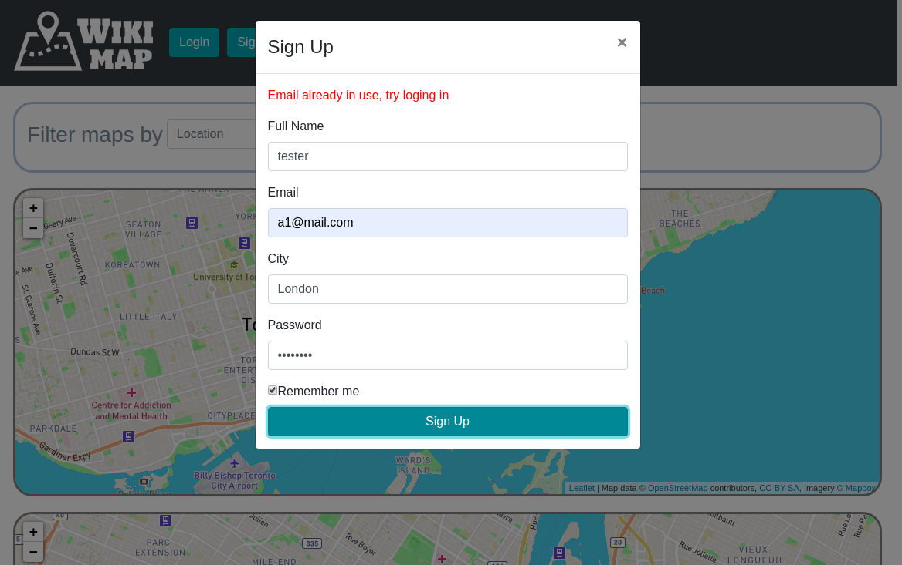
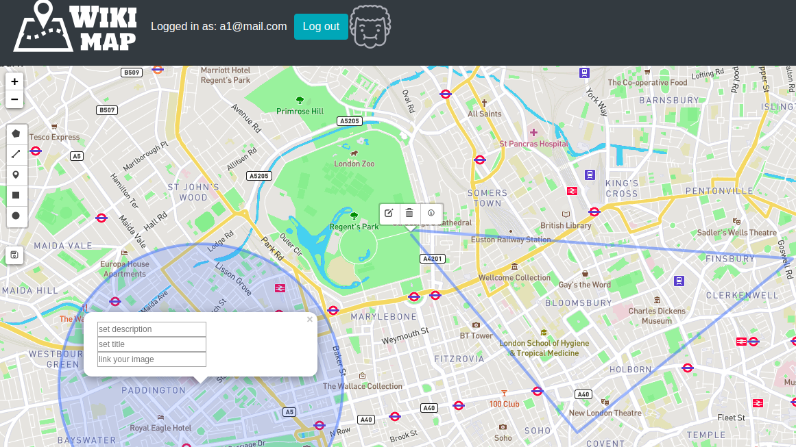
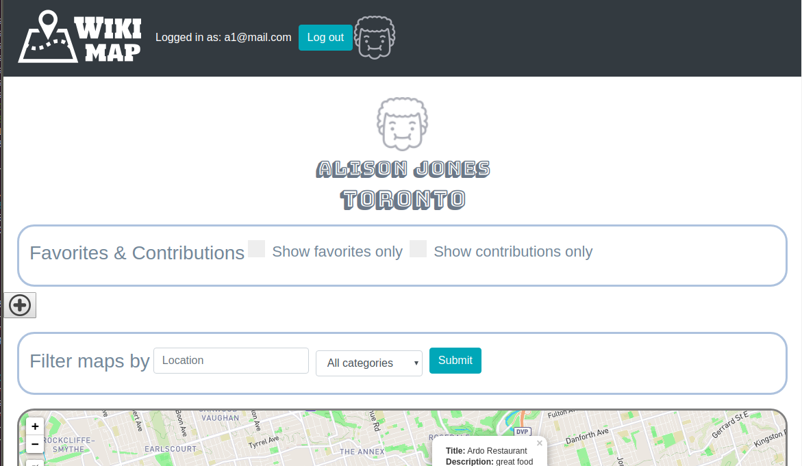
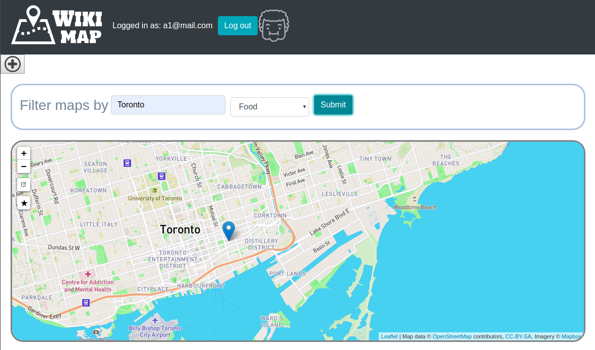

# Wiki Map

Wiki Map is an SPA (single page app) that allows users to create and collaborate on maps. Maps are generally classified by location and category (e.g. food) which can then be filtered accordingly.

Wiki Map fulfills the following:
* users can see a list of the available maps
* users can view a map
* a map can contain many points
* each point can have: a title, description, and image
* authenticated users can create maps
* authenticated users can modify maps (add, edit, remove points)
* users can favourite a map
* users have profiles, indicating their favourite maps and maps they've contributed to
* uses http://leafletjs.com/

### Front-end: 
HTML/CSS, BootstrapJS, leafletJS
### Back-end: 
NodeJS, JQuery, Express (with RESTful routes), PostgreSQL (pg)


## Dependencies

 ``` 
 "dependencies": {
    "bcrypt": "2.0.0",
    "body-parser": "^1.19.0",
    "chalk": "^2.4.2",
    "cookie-session": "^1.4.0",
    "dotenv": "^2.0.0",
    "ejs": "^2.6.2",
    "express": "^4.17.1",
    "jquery": "^3.5.0",
    "leaflet": "^1.6.0",
    "leaflet-draw": "^1.0.4",
    "leaflet-draw-toolbar": "^0.3.0-alpha.1",
    "leaflet-easybutton": "^2.4.0",
    "leaflet-toolbar": "^0.4.0-alpha.2",
    "morgan": "^1.9.1",
    "node-sass-middleware": "^0.11.0",
    "pg": "^6.4.2",
    "pg-native": "^3.0.0"
  },
  "devDependencies": {
    "nodemon": "^1.19.1"
  }
```

## Getting Started

1. Create the `.env` by using `.env.example` as a reference: `cp .env.example .env`
2. Update the .env file with your correct local information 
  - username: `labber` 
  - password: `labber` 
  - database: `midterm`
3. Install dependencies: `npm i`
4. Fix to binaries for sass: `npm rebuild node-sass`
5. Reset database: `npm run db:reset`
  - Check the db folder to see what gets created and seeded in the SDB
7. Run the server: `npm run local`
  - Note: nodemon is used, so you should not have to restart your server
8. Visit `http://localhost:8080/`

## Warnings & Tips

- Do not edit the `layout.css` file directly, it is auto-generated by `layout.scss`
- Split routes into their own resource-based file names, as demonstrated with `users.js` and `widgets.js`
- Split database schema (table definitions) and seeds (inserts) into separate files, one per table. See `db` folder for pre-populated examples. 
- Use the `npm run db:reset` command each time there is a change to the database schema or seeds. 
  - It runs through each of the files, in order, and executes them against the database. 
  - Note: you will lose all newly created (test) data each time this is run, since the schema files will tend to `DROP` the tables and recreate them.


## Sample screenshots







